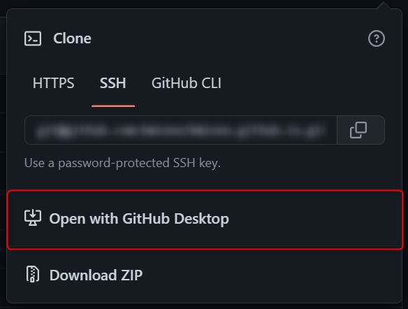

# VScodeをGitクライアントにするまでの道

## 必要なもの

- Gitのインストール
- VScodeの拡張機能
- GitHub Desktop（お好み） 

## 必要ないもの

- お金

### Gitのインストール

[公式サイト](https://git-scm.com/)からGitをダウンロードします。  
（SourceTreeを入れている方はSourceTree入れるときに入っているので問題ないです）


Git Bashを起動し、以下のコマンドを入力

```
git config --global user.name 'username'
git config --global user.email 'username@example.com'
```
※ユーザー名とメールアドレスはGitHubに登録したものを入力します

SSH接続方法なんかはこちらが参考になるかと

[【初心者向け】GitHubにSSH接続する設定方法 for Windows 10](https://yu-report.com/entry/githubSSH/)

### VScodeに入れる拡張機能

- GitLens
- Git Graph
- Commit Message Editor(お好み)

GitLensは変更差分の表示、Git Graphはツリー表示をしてくれます。  
Commit Message Editorはコミットメッセージを書きやすくする拡張機能なのでお好みです。

### GitHub Desktopのインストール（お好み）

リポジトリをクローンするのに使います。  
（※GitHub Desktopがなくてもクローン出来るので、インストールはお好み）

入れてるとワンクリックでクローンできます。



### 参考文献
[君には1時間でGitについて知ってもらう(with VSCode)](https://qiita.com/jesus_isao/items/63557eba36819faa4ad9)  
[VSCodeでのGitの基本操作まとめ](https://qiita.com/y-tsutsu/items/2ba96b16b220fb5913be)
