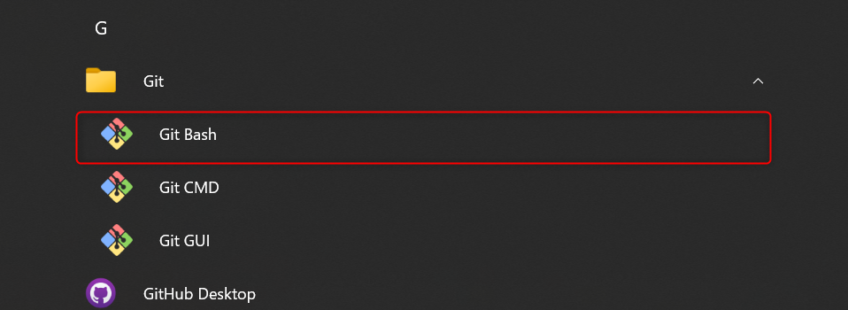

# VScodeをGitクライアントにするまでの道

# 目次

## 必要なもの

- Gitのインストール
- VScodeの拡張機能
- GitHub Desktop（お好み） 

## 必要ないもの

- お金

### Gitのインストール

[公式サイト](https://git-scm.com/)からGitをダウンロードします。  
（SourceTreeを入れている方はSourceTree入れるときに入っているので問題ないです）

Git Bashを起動し、以下のコマンドを入力



```
git config --global user.name 'username'
git config --global user.email 'username@example.com'
```
※ユーザー名とメールアドレスはGitHubに登録したものを入力します

### VScodeに入れる拡張機能

- GitLens
- Git Graph

GitLensは変更差分の表示、Git Graphはツリー表示をしてくれます。

### GitHub Desktop（お好み）

リポジトリをクローンするのに使う。（※GitHub Desktopがなくても出来るのでお好みで）

### 参考文献
[君には1時間でGitについて知ってもらう(with VSCode)](https://qiita.com/jesus_isao/items/63557eba36819faa4ad9)
[VSCodeでのGitの基本操作まとめ](https://qiita.com/y-tsutsu/items/2ba96b16b220fb5913be)