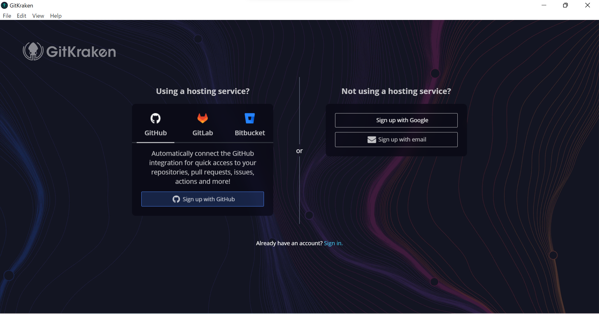

## GitKrakenのインストール

※GitHubのアカウントは既に取得している前提で進めます

[公式サイト](https://www.gitkraken.com/)からインストーラをダウンロード


インストーラを起動して、以下の画面が開いたらとりあえず完了



## サインイン


初期画面で「Sigh up wigh Github」を選択してクリック

ログインを求められるので、ユーザーネームとパスワードを入力
この画面に行ったら成功
「GitKrakenを開く」ボタンでGitKrakenを開き直す。


開き直すと「ユーザーを作って」的な事を言われるが、
profile Name:GitHubのユーザー名
Author Name:GitHubのユーザー名
Author Email:GitHubに登録したアドレス
で問題ないと思います
アイコンは好きなの選びましょう。イーカーベーダーとか生き残ったイカの子とかIKATOとか名探偵イカチュウとか居ます。

設定すると画面どうする？　って聞かれるので素直にRepo Tab選びましょう。

### Markdown

Markdown is a lightweight and easy-to-use syntax for styling your writing. It includes conventions for

```markdown
Syntax highlighted code block

# Header 1
## Header 2
### Header 3

- Bulleted
- List

1. Numbered
2. List

**Bold** and _Italic_ and `Code` text

[Link](url) and 
```

For more details see [Basic writing and formatting syntax](https://docs.github.com/en/github/writing-on-github/getting-started-with-writing-and-formatting-on-github/basic-writing-and-formatting-syntax).

### Jekyll Themes

Your Pages site will use the layout and styles from the Jekyll theme you have selected in your [repository settings](https://github.com/kmiono/kmiono.github.io/settings/pages). The name of this theme is saved in the Jekyll `_config.yml` configuration file.

### Support or Contact

Having trouble with Pages? Check out our [documentation](https://docs.github.com/categories/github-pages-basics/) or [contact support](https://support.github.com/contact) and we’ll help you sort it out.
