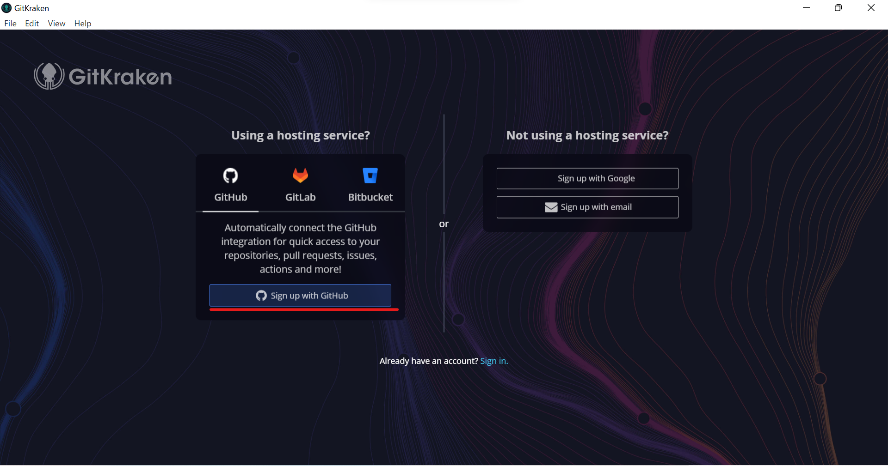
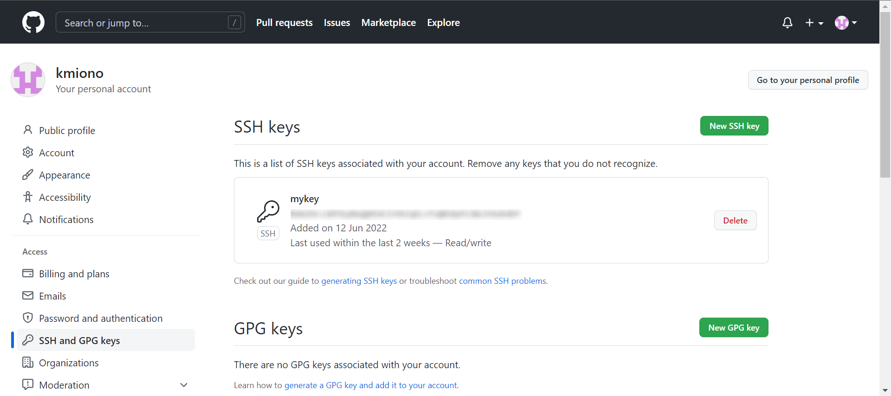
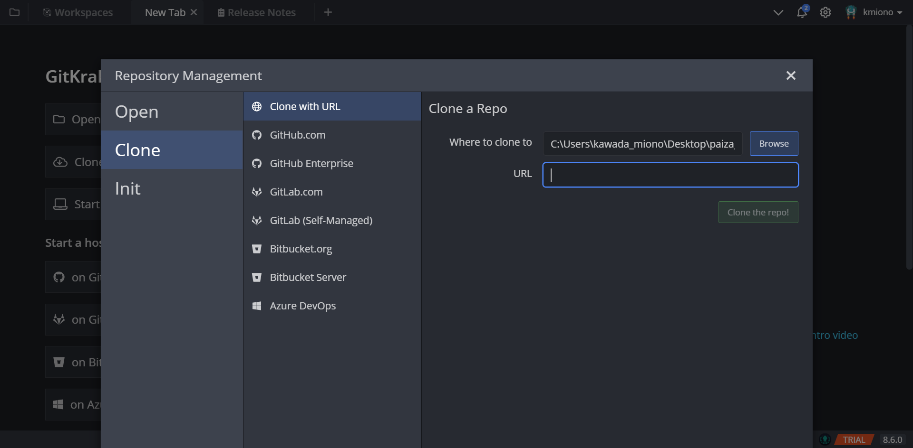

# 目次
 
  - [GitKrakenのインストール](#GitKrakenのインストール)
  - [サインイン](#サインイン)
  - [初期設定](#初期設定)
  - [クローン](#クローン)
  - [アカウント削除](#アカウント削除)

## GitKrakenのインストール

※GitHubのアカウントは既に取得している前提で進めます

[公式サイト](https://www.gitkraken.com/)からインストーラをダウンロード

インストーラを起動して、以下の画面が開いたらとりあえず完了

## サインイン

初期画面で「Sigh up wigh Github」を選択してクリック  
ログインを求められるので、ユーザーネームとパスワードを入力

この画面に行ったら成功

「GitKrakenを開く」ボタンでGitKrakenを開き直す。

開き直すと「ユーザーを作って」的な事を言われるが、

* profile Name:GitHubのユーザー名  
* Author Name:GitHubのユーザー名  
* Author Email:GitHubに登録したアドレス

で問題ないと思います

アイコンは好きなの選びましょう。イーカーベーダーとかイカ残った男の子とかNARUTOならぬIKATOとか名探偵イカチュウとか居ます。

設定すると画面どうする？　って聞かれるので素直にRepo Tab選びましょう。

Repo Tab選ぶと何か聞かれますが、有料機能を七日間トライアル（終わると無料モードに移行）なだけなので、黒い方のボタンを選びます(緑色のボタンは「仲間と一緒に始めよう」ってボタンらしいです)

※6.29追記
> _試用期間が終わるとprivateリポジトリが開けなくなります。確認不足でした。申し訳ありません。_

> 一応無料でPro使う方法がないでもないらしいのでリンク張っておきます
[【合法】GitKraken Proを完全に無料で使う方法](https://blog.fascode.net/2021/08/28/gitkraken-free/)

> ~~でもVSCode使いならGitLensとGitGraph組み合わせて使った方が手間かからないような~~

## 初期設定

この状態でリポジトリをクローンしようとすると、「SSHキーがないよ！」と怒られるので、

ここから  
SSHタブを押してこの画面にいきます。  
四角で囲った部分を押すとsshキーを保存する画面が開くので、分かる場所（ドキュメントとか）に保存します。

「success!」の文字が出たら、

の四角に囲われた部分を押してキーをコピーします。

自分のGitHubを開いて、アカウントから「Settings」>「SSH and GPG keys」を開きます。

「New SSH key」ボタンを押すと次の画面に行くので、SSHキーの名前を入力して、先ほどコピーしたもの（ssh-rsa ～）を「key」の部分にペーストします。GitKrakenの操作してない限りはいつでもコピペし直せるので安心してください（この記事書く間に何度もコピペし直した人）。

※流石にキーの中身は伏せてます。

これでGitHubとGitKrakenの連携が出来て、リポジトリがクローンできるようになりました。

## クローン

GitKrakenの画面の「Clone a repo」を押します。

分かる場所に空ファイルを作っておいて、Browseで作った空ファイルを選択します。

※GitKrakenがフォルダ作ってくれるので、デスクトップ選択、Cドライブ選択でも大丈夫です。

GitHubでクローンしたいリポジトリの「code」ボタン>SSHタブに現れるurlをコピーします。

GitKrakenのURLにペーストすると以下の画面になるので

「Clone the repo!」ボタンを押します

こんなメッセージが出てきたら「Open now!」を押しましょう。

おめでとうございます、リポジトリがクローンできました！

## アカウント削除

**※以降手順はアカウントを削除したい場合のみ**

GitKrakenの画面右下に「free」/「Pro」が表示されているかと思われるので、そこをクリック

アカウントマネージャーが開きます。

 

~~いじくってチーム（企業？）を追加した痕跡が……~~

アカウントマネージャーの中のACCOUNT INFO＞Delete My Accountをクリック  
そうすると以下のようなウィンドウが開きます。

 

表示に則って「Delete My Account」を入力（Bot防止なのでコピペできません。真似して手打ちしましょう）  
入力して「Delete your account」ボタンをクリックするとイカが泣いてる画像が暫く表示されます。待ちましょう。

以下の画面に戻れば完了

 
