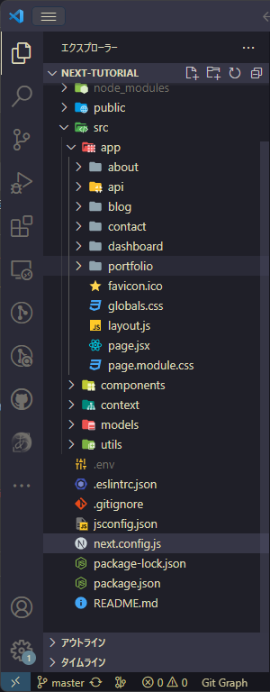
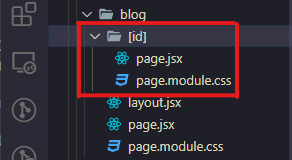

# Next.js 学習記録

## ディレクトリ構成



※初期状態は public フォルダと app フォルダくらいしかない
※src フォルダを作るかは任意

アイコンがついているフォルダについてのみ記述する

### app

`app/page.jsx`（または`tsx`）は index ページ（`localhost:3000`）となる。
app フォルダ以下にフォルダ/page とすることで、簡単にルーティングができる。

例えば上の画像でいえば`app/about/page.jsx`が`localhost:3000/about`として画面に反映される。

### components

共通部品。
複数の画面で使用する機能を格納する。
ナビゲーションバーやヘッダー、フッター、など。

### contens

ちょっと良く把握できてない。保留

### models

スキーマを記述する。

```
スキーマとは：スキーマとは、データベースの構造を定義したものです。 データベースのデータをどう管理するかの、一連の約束を意味します。

[用語集｜スキーマ/スキーマレスDB - IDCフロンティア](https://www.idcf.jp/words/schema.html#:~:text=%E3%82%B9%E3%82%AD%E3%83%BC%E3%83%9E%E3%81%A8%E3%81%AF%E3%80%81%E3%83%87%E3%83%BC%E3%82%BF%E3%83%99%E3%83%BC%E3%82%B9%E3%81%AE,%E3%82%B9%E3%82%AD%E3%83%BC%E3%83%9E%E5%AE%9A%E7%BE%A9%E3%81%AE%E4%B8%80%E7%A8%AE%E3%81%A7%E3%81%99%E3%80%82)
```

一例

```Javascript
name: {
      type: String,
      unique: true,
      required: true,
    },
```

ここはスキーマの概念が理解できれば何を入れるのか大体理解できる。

### utils

ここもあまりよく理解していない。
サーバーサイドに共通するもの（DB 設定ファイル）を入れるっぽい……？

### public

全体共通で使用する部品（画像など）を入れておく。

#### 参考

- [Next.js ディレクトリ構成を設計再考してみる](https://note.com/ryoppei/n/n2e3e7a66e758#8f6a30af-f77f-4244-b12e-b68be0e03a92)
- [【小規模サイト向け】Next.js ディレクトリ構成とコーディングルール](https://zenn.dev/necscat/articles/d5d9b7a3f859d7)

日本語で探すとやっぱりどうしても最新の情報が手に入りづらいですね。
それとも ver13 の途中で大幅な変更が入った？

## ルーティング

`Link`タグでリンクを作る事が出来ます。
古い資料だと`Link`タグの中に`a`タグが必要とあったりしますが、今やると逆にエラーになります。`Link`タグだけで大丈夫です。
上述の`app`フォルダの説明にあるように、`app`フォルダの中にリンク先フォルダ/page.jsx（or tsx）を入れることで url が決定します

### 一意の URL にしたくないとき

ブログの記事ページなど、適当な URL を設定したい場合は、該当のページフォルダを`[id]`のように角カッコで括ります



[id]フォルダ内の`page.jsx`で値を受け取るようにすれば、`localhost:3000/blog/1`とか`localhost:3000/blog/123`などの URL で記事が表示されます。

id を振るのは、この場合 blog フォルダ内の`page.jsx`です。

コード(`app/blog/page.jsx`)

```Javascript
import React from "react";
import styles from "./page.module.css";
import Image from "next/image";
import Link from "next/link";

async function getData() {
  const res = await fetch("http://localhost:3000/api/posts", {
    cache: "no-store",
  });

  if (!res.ok) {
    throw new Error("Failed to fetch data");
  }

  return res.json();
}

const Blog = async () => {
  const data = await getData();
  return (
    <div className={styles.mainContainer}>
      {data.map((item) => (
        <Link
          href={`/blog/${item._id}`}//ここでリンク先URLを指定
          className={styles.container}
          key={item.id}>
          <div className={styles.imageContainer}>
            <Image
              src={item.img}
              alt=""
              width={400}
              height={250}
              className={styles.image}
            />
          </div>
          <div className={styles.content}>
            <h1 className={styles.title}>{item.title}</h1>
            <p className={styles.desc}>{item.desc}</p>
          </div>
        </Link>
      ))}
    </div>
  );
};

export default Blog;

```

## イベント

```javascript
const handleClick = (e) => {
  console.log(e.target.href);
  e.preventDefault();
};

<button onClick={handleClick}></button>;
```

`e.target`
　指定された値を受け取る。`e.target.value`など

`onClick={handleClick}`
　外部で設定した関数を、指定のアクションをした際に呼び出す。この場合クリック

## React Hooks

### useState

状態を変化させたいとき

### useEffect

呼び出しをかけたいとき
