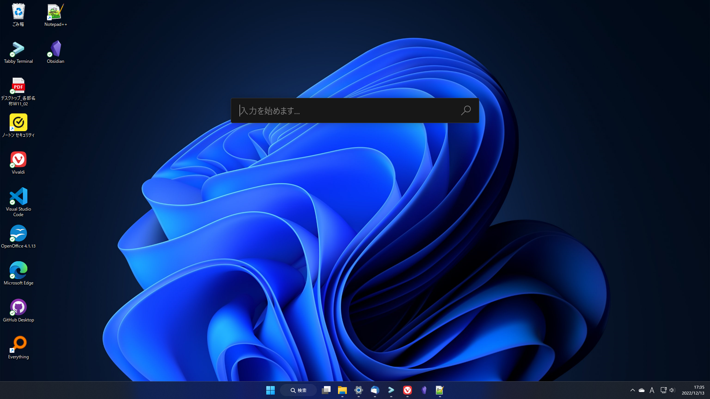
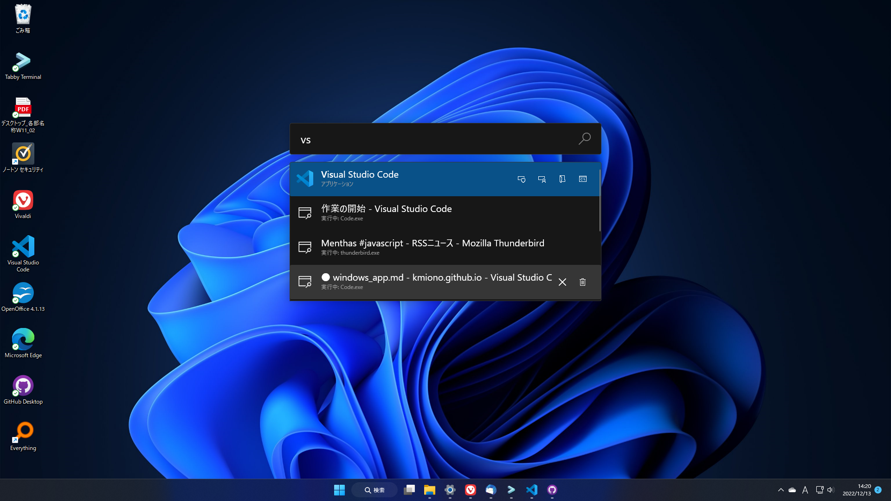

# Windows環境設定メモ

デスクトップ新調したので

## 環境

- Windowsエディション Windows 11 Home
- バージョン 22H2
- プロセッサ 12th Gen Intel(R) Core(TM) i5-12400   2.50 GHz
- RAM 16.0 GB

### 入れたツール

1. PowerToys
2. f.lux
3. focus to-do
4. Everything
5. Revo Uninstaller
6. Git
7. GitHub Desktop
8. Vivaldi
9.  OpenOffice
10. Thunderbird
11. Tabby Terminal
12. VScode

#### PowerToys

Microsoft謹製の十徳ナイフ。Microsoft storeからインストールできる。  
Alt+Enterで発動するランチャーモードが非常に便利。  
  

次いでCtrl二連打で発動するカーソルフォーカスが便利。でもこっちは「アクセシビリティ＞マウスポインターとタッチ」でカーソルを見やすい色に変えとけばいいと思う
  
詳しいことは下記  
[Microsoft公式ツール「Powertoys」を解説。なんでこの機能、Windowsに標準で入ってないの？という神機能が特盛！](https://smhn.info/202101-how-to-use-microsoft-windows-powertoys)  

#### f.lux

時間帯で画面の明るさが変えてくれる。  
しかも朝起きる時間を設定しておくと「そろそろ寝る時間」の通知を出してくれるので、規則正しい生活を送る一助になります（通知に従うとは言わない）  

#### focus to-do
タスク管理アプリ。個人的に定期的に貸与PCを確認するためのタイマー扱い。  
普通に管理アプリとしても有用。基本無料で、機能を最大限使うにはアップグレード（課金）が必要なタイプだが、無料でも十分役に立つ。  

#### Everything
Windowsはこいつがないとファイル検索が始まらない。  
とても速い。「あのファイルどこ…？」を一瞬で検索してくれる。  

#### Revo Uninstaller
アンインストーラー。アンストするときに該当ソフトの設定ファイルまで消してくれる。  
こいつも全機能開放するのに課金が必要なタイプ。普段使いする程度なら無料で十分。  
[Revo Uninstaller のインストールと使い方](https://eizone.info/revo-uninstaller/)

#### Git
入ってないことに気づいたので。  
コマンドでGit操作するときに必要。  

#### GitHub Desktop
GitHub公式のクライアント。多少英語が読めればGitHubのサイトに行かなくてもリポジトリが作れたりクローンできる。  

#### Vivaldi
ブラウザ。メモリが軽い。  
単純に今までVivaldi使ってたので、アカウント作るだけで楽と思って選んだ。  
セッション保存機能が神。  
(Windowsデフォルトの)Edgeも実はそんなに悪くない。慣れれば。  

#### OpenOffice
Office代替。  

#### Thunderbird
Outlook代替。ついでにRSSフィードにしていたslackの代替も。  

#### Tabby Terminal
ターミナルアプリ。起動に時間がかかるけれど、タブ機能がある、カラーテーマがある、WSLに接続できるとなかなか高機能。しかも軽い。  
Windows Terminalもタブ機能があってWSLに接続できますが、デフォルトの画面がでかいので（見た目改造したせいかもしれない…）こっちにしました。  

#### VScode

こいつがいないとお話にならない。  

入れている拡張

##### オールマイティ
1. Japanese Language Pack for Visual Studio Code - 日本語化
2. Kanagawa - カラーテーマ
3. Pretter - コード見やすく
4. Auto import - 自動インポート
5. indent-rainbow - インデントに色を付けて見やすく
6. zenkaku - 全角強調
   
##### Git関係
1. GitLens - 差分表示
2. Git Graph - コミットグラフ表示
3. Commit Message Editor - コミットメッセージエディター
   
##### マークダウン
1. Markdown All in One - マークダウンの拡張
   
##### マークアップ
1. Auto Close Tag - HTMLタグ自動クローズ
2. Auto Rename Tag - HTMLタグ自動リネーム

##### Flutter
1. Flutter - Flutterの拡張
2. Dart - Dartの拡張
3. Flutter Color - Flutterの色指定をわかりやすくする
4. Flutter Widget Snippets - Flutterの補完

##### Vue
1. Vue Language Features (Volar) - Vue拡張詰め合わせ（JS対応）

### 入れたSDKとか

- Node.js
- FlutterSDK

とりあえずnpmさえ動いてくれれば後から必要なものを`npm install`できる
